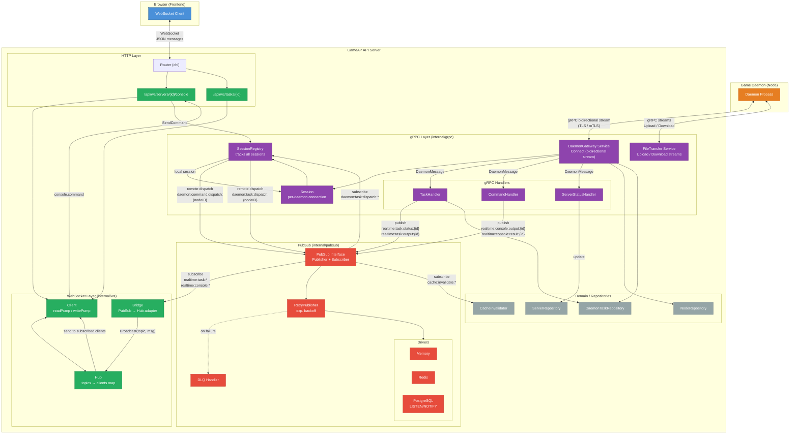
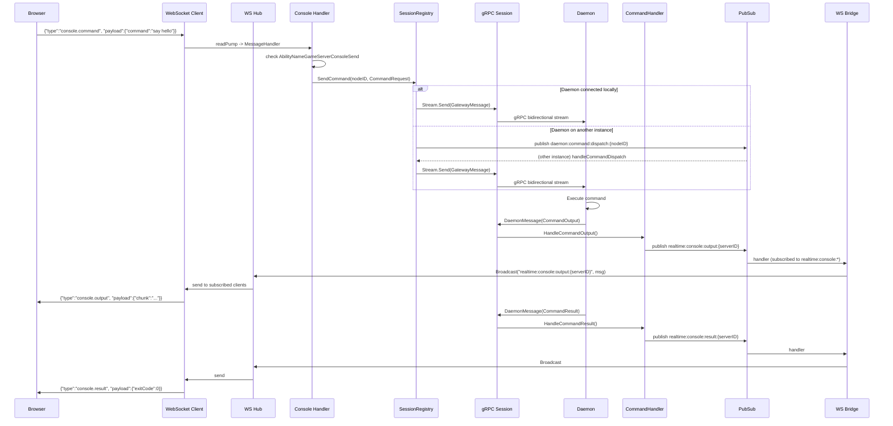
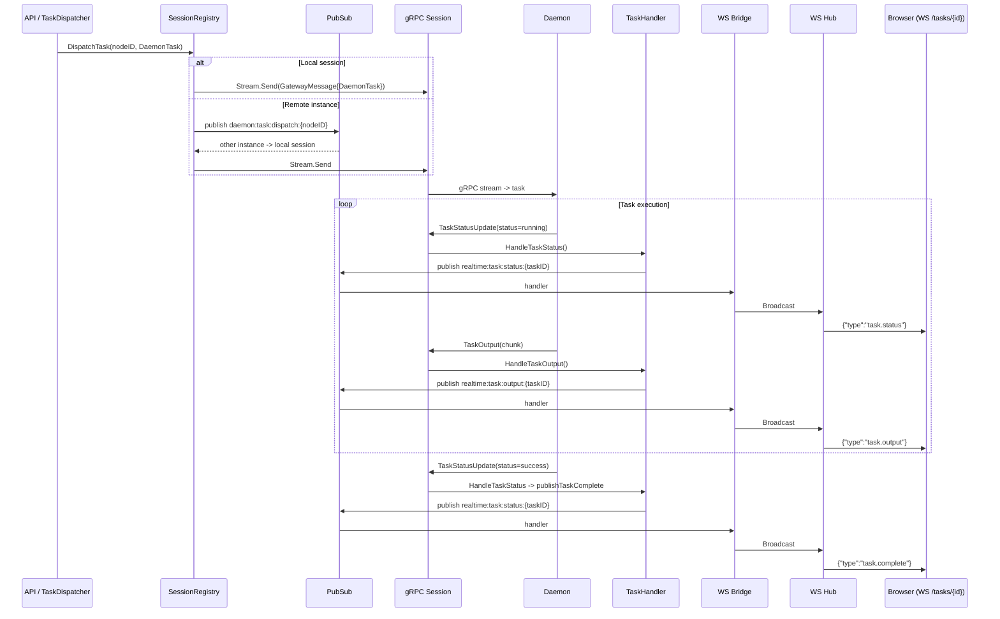

# gRPC, PubSub & WebSocket Architecture

## High-Level Overview

## Data Flow: Console Command (Full Cycle)

## Data Flow: Task Execution

## PubSub Channels

| Category | Channel | Publisher | Subscriber |
|----------|---------|-----------|------------|
| Console | `realtime:console:output:{serverID}` | CommandHandler | WS Bridge |
| Console | `realtime:console:result:{serverID}` | CommandHandler | WS Bridge |
| Task | `realtime:task:status:{taskID}` | TaskHandler | WS Bridge |
| Task | `realtime:task:output:{taskID}` | TaskHandler | WS Bridge |
| Dispatch | `daemon:task:dispatch:{nodeID}` | SessionRegistry | SessionRegistry (other instance) |
| Dispatch | `daemon:command:dispatch:{nodeID}` | SessionRegistry | SessionRegistry (other instance) |
| Cache | `cache:invalidate:*` | Application | CacheInvalidator |
| Session | `daemon:session:connected` | SessionRegistry | - |
| Session | `daemon:session:closed` | SessionRegistry | - |

All channels are prefixed with `gameap:` (e.g., `gameap:realtime:task:status:{id}`). The WS Bridge strips this prefix when converting to WebSocket topics.

## Key Components

| Component | Location | Role |
|-----------|----------|------|
| `Hub` | `internal/ws/hub.go` | Routes messages by topic to WebSocket clients |
| `Client` | `internal/ws/client.go` | Single WS connection (readPump + writePump) |
| `Bridge` | `internal/ws/bridge.go` | Adapter from PubSub to Hub, strips `gameap:` prefix |
| `Session` | `internal/grpc/session/session.go` | Single gRPC connection with a daemon |
| `SessionRegistry` | `internal/grpc/session/registry.go` | Registry of all sessions + cross-instance dispatch via PubSub |
| `DaemonGateway` | `internal/grpc/gateway/service.go` | Bidirectional streaming gRPC service |
| `FileTransferService` | `internal/grpc/filetransfer/service.go` | File upload/download streaming gRPC service |
| `TaskHandler` | `internal/grpc/handlers/task_handler.go` | Processes task status/output from daemons |
| `CommandHandler` | `internal/grpc/handlers/command_handler.go` | Processes command output/results from daemons |
| `ServerStatusHandler` | `internal/grpc/handlers/server_status_handler.go` | Processes server status batch updates |
| `PubSub` | `internal/pubsub/pubsub.go` | Interface with Memory / Redis / PostgreSQL drivers |
| `RetryPublisher` | `internal/pubsub/retry/publisher.go` | Wrapper with exponential backoff + DLQ |

## gRPC Services

### DaemonGateway (`pkg/proto/gateway.proto`)

- `Connect(stream DaemonMessage) returns (stream GatewayMessage)` — bidirectional stream for persistent daemon connections
- `Enroll(EnrollRequest) returns (EnrollResponse)` — daemon enrollment (no auth required)

**DaemonMessage types** (daemon -> server): `RegisterRequest`, `Heartbeat`, `TaskStatusUpdate`, `TaskOutput`, `CommandOutput`, `CommandResult`, `ServerStatusBatch`

**GatewayMessage types** (server -> daemon): `RegisterAck`, `DaemonTask`, `TaskCancel`, `CommandRequest`, `ServerConfigBatch`, `ShutdownNotification`

### FileTransferService (`pkg/proto/filetransfer.proto`)

- `UploadFile(stream UploadChunk) returns (UploadResult)` — client streaming upload with SHA256 checksum
- `DownloadFile(DownloadRequest) returns (stream DownloadChunk)` — server streaming download
- `FileOperation(FileOperationRequest) returns (FileOperationResponse)` — delete, move, copy, chmod, mkdir, touch, stat, exists
- `ListDirectory(ListDirectoryRequest) returns (ListDirectoryResponse)` — directory listing

## PubSub Drivers

| Driver | Backend | Use Case |
|--------|---------|----------|
| Memory | In-process | Testing, single-instance deployments |
| Redis | Redis PUBLISH/SUBSCRIBE | Multi-instance with Redis available |
| PostgreSQL | LISTEN/NOTIFY | Multi-instance without Redis (7900 byte payload limit) |

Configured via `config.PubSub.Driver`. Optional retry wrapper (`config.PubSub.Retry`) and DLQ handler (`config.PubSub.DLQ`).

## Server Startup Sequence

1. Create container (lazy-initializes all services)
2. Run migrations, seed database, load plugins
3. `startPubSub()`:
   - CacheInvalidator subscribes to `cache:invalidate:*`
   - WS Bridge subscribes to `realtime:task:*` and `realtime:console:*`
   - PubSub listener starts (blocks in goroutine)
4. gRPC server starts — SessionRegistry subscribes to `daemon:task:dispatch:*`
5. HTTP server starts (shares port with gRPC via `cmux` multiplexer)

## Authentication

- **gRPC**: API key (`x-api-key` + `x-node-id` metadata) or mTLS
- **WebSocket**: Session-based auth via HTTP middleware + RBAC permission checks
- **Enroll RPC**: Public (no auth)
